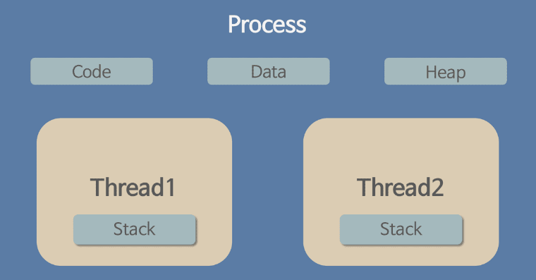

# 프로세스와 스레드

### 프로세스란?

프로그램이 실행되면 프로세스 인스턴스가 생성된다. 인스턴스가 생성된다는 의미는 프로그램 실행에 필요한 내용이 컴퓨터 메모리(RAM)에 적재된다는 뜻이다. 운영체제를 통해 여러 프로세스를 실행하고 관리할 수 있다. 이를 멀티 태스킹이라고 한다.

프로그램 : 어떤 작업을 하기 위해 실행할 수 있는 파일 또는 프로그램.exe

프로세스 : 메모리에 적재되고 CPU 자원을 할당받아 프로그램이 실행되고 있는 상태

프로세스는 4가지 구조로 되어있다.

1. 코드 영역 : 프로그래머가 작성한 프로그램이 코드 영역에 작성된다.
2. 데이터 영역 : 코드가 실행되면서 사용한 변수나 파일들의 각종 데이터들이 모여있다.
3. 스택 영역 : 호출한 함수가 종료되면 되돌아올 메모리의 주소를 스택에 저장하거나 변수 사용 범위에 영향을 미치는 영역을 구현할 때 사용된다.
4. 힙 영역 : 동적으로 할당되는 데이터들을 위해 존재하는 공간이다.

원칙적으로 다른 프로세스간의 메모리 공간 접근은 허용되지 않는다.

### 스레드란?

어떠한 프로그램 내에서, 특히 프로세스 내에서 실행되는 흐름의 단위를 말한다.

일반적으로 하나의 프로그램은 하나 이상의 프로세스를 가지고 있고, 하나의 프로세스는 반드시 하나 이상의 스레드를 갖는다.

즉 프로세스를 생성하면 기본적으로 하나의 메인 스레드가 생성되는 것이다.

스레드는 프로세스 내에서 각각 stack만 따로 할당받고 Code, Data, Heap 영역은 공유한다.

스레드는 한 프로세스 내에서 동작되는 여러 실행의 흐름으로, 같은 프로세스 안에 있는 여러 스레드들은 같은 힙 공간을 공유한다.

### 멀티 프로세스, 멀티 스레드

멀티 프로세스 : 하나의 프로그램을 여러 개의 프로세스로 구성하여 각 프로세스가 하나의 작업을 처리하는 것. 장점은 하나의 프로세스가 잘못 되어도 프로그램은 동작하고, 단점은 context switching 비용이 발생한다.

context switching이란, cpu에서 여러 프로세스를 돌아가면서 작업을 처리하는 과정이다. 동작중인 프로세스가 대기를 하면서 해당 프로세스의 상태(context)를 보관하고 대기하고 있다가 다시 실행시 복구하는 비용(시간)을 말한다.

멀티 스레드 : 프로그램을 여러개의 스레드로 구성하고 각 스레드가 작업을 처리하는 것. 장점에는 시스템 자원 소모 감소, 처리 비용 감소(실행 속도 향상), 스레드간 자원 공유(stack을 제외한 영역)이 있고, 단점으로는 디버깅이 어렵고, 동기화 이슈가 발생하고, 하나의 스레드의 오류로 전체 프로세스에 문제가 발생한다는 것이다.

thread safe란, 여러 스레드가 동시에 사용되어도 안전하다는 것을 뜻한다. 특정 함수 a와 변수 aa가 여러 스레드에서 호출되어도 하나의 스레드에서 호출했을 때와 같은 결과가 보장되어야 한다는 의미이다. 함수가 전역 변수를 참조하게 된다면 그 함수는 thread safe하지 않은 결과가 나올 수 있다.