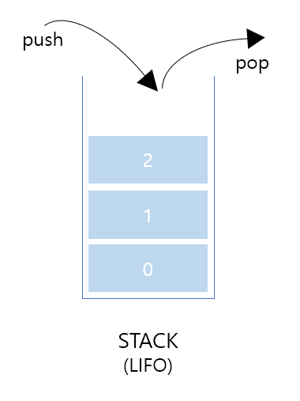
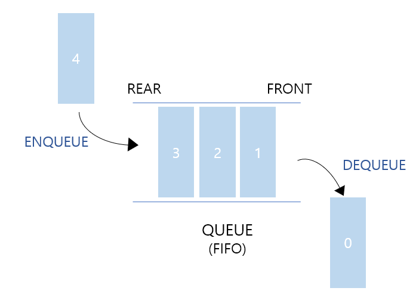

# stack과 queue

### Stack

스택이란 어떠한 자료를 쌓아서 올려놓은 형태의 자료구조.

스택의 특징

- 가장 마지막에 삽입된 자료가 가장 먼저 삭제된다. - **후입선출(LIFO)**
- 자료의 **삽입(push)과 삭제(pop)가 한 곳(top)에서만** 이루어진다.

만약 스택이 비어있을 때 자료를 꺼내려고 하면 **스택 언더플로우**가 발생하고 스택이 꽉 차 있을 때 자료를 넣으려고 하면 **스택 오버플로우**가 발생한다.

스택의 활용 예시

- 웹 브라우저 뒤로가기
- 문서작업에서 ctrl + z (실행 취소)
- 역순 문자열 만들기
- 후위 표기법 계산

### Queue

데이터들이 일렬로 줄 서서 기다리는 것

큐의 특징

- 먼저 들어온 데이터가 먼저 나가는 구조 - **선입선출(FIFO)**
  - 삭제 연산이 이루어지는 곳 프론트(enQueue)
  - 삽입 연산이 이루어지는 곳 리어(deQueue)

큐의 활용 예시

- 은행 창구에서의 번호표 대기
- 프린터 출력
- 프로세서 관리
- 너비 우선 탐색(BFS) 알고리즘