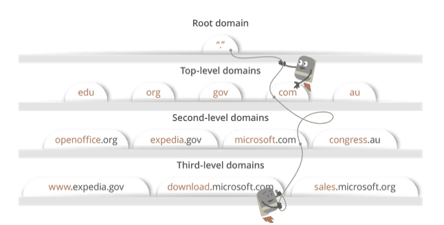

# 브라우저 주소창에 www.google.com을 입력하면 일어나는 일

1. 브라우저는 캐싱된 DNS 기록들을 통해 www.google.com에 대응되는 IP주소가 있는지 확인한다.

   DNS는 사람들이 웹사이트 주소에 쉽게 접속할 수 있게 매핑을 해주는 역할을 한다. 

   브라우저는 DNS 기록을 4가지의 캐시에서 확인을 한다.

   1. 브라우저 캐시를 확인한다. 브라우저는 일정기간 동안의 DNS 기록들을 저장하고 있다. DNS query가 이곳에서 가장 먼저 실행된다.
   2. 그 다음으로 OS 캐시를 확인한다. 브라우저 캐시에서 웹사이트 이름의 IP주소가 발견되지 않았다면, 브라우저는 systemcall을 통해서 OS가 저장하고 있는 DNS 기록들의 캐시에 접근한다.
   3. 그다음에는 router 캐시를 확인한다. 컴퓨터에서 DNS 기록을 찾지 못하면 브라우저는 DNS 기록을 캐싱하고 있는 router와 통신을 해서 찾으려고 한다.
   4. 그래도 못 찾으면, 마지막으로 ISP 캐시를 확인한다. ISP는 DNS 서버를 구축하고 있고 브라우저가 마지막으로 DNS 기록이 있기를 바라며 접근하게 된다.

2. 요청한 URL이 캐시에 없으면 ISP의 DNS 서버가 www.google.com을 호스팅하고 있는 서버의 IP 주소를 찾기 위해 DNS query를 날린다.

   DNS query의 목적은 여러 다른 DNS 서버들을 검색해서 해당 사이트의 IP주소를 찾는 것이다.이러한 검색을 recursive search라고 부른다. IP 주소를 찾을 때까지 DNS 서버에서 다른 DNS 서버를 오가면서 반복적으로 검색하다가 못 찾아서 에러가 발생할 때 까지 검색을 진행한다.  이때, ISP의 DNS 서버를 DNS recursor라고 부르고 인터넷을 통해 다른 DNS 서버들에게 물어 물어 도메인 이름의 올바른 IP주소를 찾는데 책임을 갖고 있다. 다른 DNS 서버들은 name server라고 불린다. 웹사이트 도메인 이름의 구조에 기반해서 검색을 하기때문이다.

   

   처음에 DNS recursor가 root name server에 연락을 한다. root name 서버는 .com 도메인 name server로 리다이렉트한다. .com name server는 google.com name server로 리다이렉트하고, google.com name server는 DNS 기록에서 www.google.com에 매칭되는 IP 주소를 찾고 DNS recursor로 보내게 된다.

   

3. 브라우저가 서버와 TCP connection을 한다.

   브라우저가 올바른 IP 주소를 받게 되면 서버와 connection을 빌드하게 된다. 브라우저는 인터넷 프로토콜을 사용해서 서버와 연결이 된다. 일반적으로 웹사이트의 HTTP 요청의 경우에는 TCP를 사용한다. TCP/IP three-way handshake라는  프로세스를 통해서 클라이언트와 서버간 connection이 이뤄지게 된다.

4. 브라우저가 웹 서버에 HTTP 요청을 한다.

   TCP로 연결이 되었다면, 데이터를 전송하면 된다.클라이언트의 브라우저는 GET 요청을 통해 서버에게 www.google.com웹페이지를 요구한다.

5. 서버가 요청을 처리하고 response를 생성한다.

6. 서버가 HTTP response를 보낸다.

7. 브라우저가 HTML content를 보여준다.

출처

https://devjin-blog.com/what-happen-browser-search/

https://velog.io/@eassy/www.google.com%EC%9D%84-%EC%A3%BC%EC%86%8C%EC%B0%BD%EC%97%90%EC%84%9C-%EC%9E%85%EB%A0%A5%ED%95%98%EB%A9%B4-%EC%9D%BC%EC%96%B4%EB%82%98%EB%8A%94-%EC%9D%BC

https://leeph.tistory.com/39