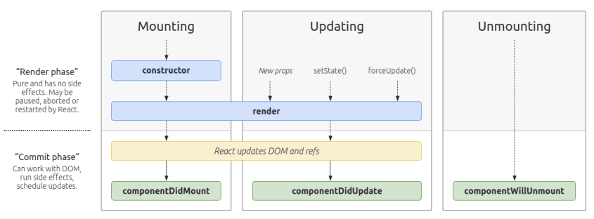

# React Life Cyle Method

생명 주기 메서드는 컴포넌트가 브라우저 상에서 나타나고, 업데이트되고, 사라지게 될 때 호출되는 메서드이다.

생명 주기 메서드는 클래스형 컴포넌트에서만 사용할 수 있다.

생명 주기 메서드는 총 9가지가 있고, 이 메서드들은 서드파티 라이브러리를 사용하거나, `DOM에 직접 접근해야하는 상황`에서 유리하다.

 [ React 17이상 버전 생명주기 ]



출처 : http://projects.wojtekmaj.pl/react-lifecycle-methods-diagram/

[ 알아두면 좋은 것 ]

- `will` 접두사가 붙은 메서드 => `어떤 작업을 작동하기 전`에 실행
- `Did` 접두사가 붙은 메서드 => 어떤 작업을 작동한 후에 실행

[ 레거시 생명 주기 메서드]

17버전 이전에 사용하던 메서드인데 17버전 이후 deprecated된 메서드들이 있다. 여전히 사용이 가능하지만, 새로 작성하는 코드에 대해서는 사용하지 않을 것을 권장한다고 공식 문서에 나와있다. 

- componentWillMount()
- componentWillUpdate()
- componentWillRecivedProps()

라이프 사이클은 총 3가지 `Mount`, `Update`, `Unmount` 카테고리로 나뉜다.

## Mount

DOM이 생성되고 웹 브라우저상에 나타나는 것

[ 마운트시 호출 되는 메서드 ]

- constructor : 컴포넌트를 새로 만들 때마다 호출되는 클래스 생성자 메서드
- getDerivedStateFromProps : props에 있는 값을 state에 넣을 때 사용하는 메서드
- render : 준비한 UI를 렌더링하는 메서드
- componentDidMount : 컴포넌트가 웹 브라우저상에 나타난 후 호출하는 메서드

[ 마운트 과정 ]

컴포넌트의 인스턴스가 생성되어 DOM 상에 삽입될 때에 순서대로 호출된다.

- constructor()
- static getDerivedStateFromProps()
- render()
- componentDidMount


## UPDATE

컴포넌트는 다음 4가지 경우에 업데이트된다.

1. props가 바뀔 때
2. state가 바뀔 때
3. 부모 컴포넌트가 렌더링될 때
4. this.forceUpdate로 강제로 렌더링 트리거할 때

업데이트시 호출되는 메서드

- getDerivedStateFromProps : 앞서 mount 과정에서도 호출되고, props 변화에 따라 state 값에도 변화를 주고 싶을 때 사용
- shouldComponentUpdate : 컴포넌트가 리렌더링을 해야 할지 말아야 할지를 결정, true를 반환하면 다음 라이프사이클 메서드를 계속 실행, false를 반환하면 작업을 중지(리렌더링X)한다.
- render : 컴포넌트를 리렌더링 한다.
- getSnapshotBeforeUpdate : 컴포넌트 변화를 DOM에 반영하기 바로 직전에 호출
- componentDidUpdate : 컴포넌트의 업데이트 작업이 다 끝난 후 호출

[ 업데이트 과정 ]

props 또는 state가 변경되면 갱신이 발생한다. 컴포넌트가 다시 렌더링될 때 다음과 같은 순서대로 호출된다.

- static getDerivedStateFromProps()
- shouldComponentUpdate()
- render()
- getSnapshotBeforeUpdate()
- componentDidUpdate()


## UNMOUNT

mount의 반대 과정, 즉 컴포넌트를 DOM에서 제거하는 것

언마운트시 호출되는 메서드

- componentWillUnmount : 컴포넌트가 웹 브라우저 상에서 사라지기 전에 호출


## 오류 처리

아래 메서드들은 자식 컴포넌트를 렌더링하거나, 자식 컴포넌트가 생명주기 메서드를 호출하거나, 또는 자식 컴포넌트가 생성자 메서드를 호출하는 과정에서 오류가 발생했을 때에 호출된다.

- static getDerivedStateFromError()

  하위의 자손 컴포넌트에서 오류가 발생했을 때 호출되는 메서드이다. 이 메서드는 매개변수로 오류를 전달받고, 갱신된 state 값을 반드시 반환해야 한다.

- componentDidCatch()

  자손 컴포넌트에서 오류가 발생했을 때에 호출되며, 2개의 매개변수(error, info)를 전달 받는다. 이 메서드는 "커밋"단계에서 호출되므로, 부수 효과를 발생시켜도 된다. 오류 로그 기록 등을 위하여 사용하면 된다.


## 자주 사용되는 메서드 정리

### render()

redner() 메서드는 클래스 컴포넌트에서 반드시 구현되어야 하는 유일한 메서드이다. 이 메서드가 호출되면 this.props와 this.state의 값을 활용하여 아래의 것 중 하나를 반환해야 한다.

- React  elemnet
- 배열과 Fragment
- Protal
- 문자열과 숫자
- Boolean이나 null

render() 함수는 순수해야 한다. 즉, 컴포넌트의 state를 변경하지 않고, 호출될 때마다 동일한 결과를 반환해야 하며, 브라우저와 직접적으로 상호작용을 하지 않아야 한다. 만약 브라우저와 직접적으로 상호작용해야 하는 경우가 생긴다면, 해당 작업을 `componentDidMount()`나 다른 생명주기 메서드 내에서 수행해야 한다. reder()를 순수하게 유지해야 컴포넌트이 동작을 이해하기 쉽다.


### constructor()

**메서드를 바인딩하거나 state를 초기화하는 작업이 없다면, 해당 React 컴포넌트에는 생성자를 구현하지 않아도 된다.**

React 컴포넌트의 생성자는 해당 컴포넌트가 마운트되기 전에 호출된다. React.component를 상속한 컴포넌트의 생성자를 구현할 때에는 다른 구문에 앞서 super(props)를 호출해야 한다. 그렇지 않아면 this.props가 생성자 내에서 정의되지 않아 버그로 이어질 수 있다.

React에서 생성자는 보통 아래의 두가지 목적을 위해 사용된다.

- this.state에 객체를 할당하여 지역 state를 초기화할 때
- 인스턴스에 이벤트 처리 메서드를 바인딩할 때

**constructor() 내부에서 setState()를 호출하면 안된다.** 컴포넌트에 지역 state가 필요하다면 생성자 내에서 this.state에 초기 state 값을 할당하면 된다.

```javascript
constructor(props) {
  super(props);
  // 여기서 this.setState()를 호출하면 안 됩니다!
  this.state = { counter: 0 };
  this.handleClick = this.handleClick.bind(this);
}
```

생성자는 this.state를 직접 할당할 수 있는 유일한 곳이다. 그 외의 메서드에서는 this.setState()를 사용해야 한다.

!! 주의 !!

state에 props를 복사하면 안된다!! 이는 불필요한 작업이며 버그를 발생시킨다. 가장 흔히 하는 실수 중 하나이니 주의하자.

```javascript
constructor(props) {
 super(props);
 // 이렇게 하지 마세요!
 this.state = { color: props.color };
}
```


### componentDidMount()

componentDidMount()는 컴포넌트가 마운트된 직후, 즉 트리에 삽입된 직후에 호출된다. 

DOM 노드가 있어야 하는 초기화 작업은 이 메서드에서 이루어지면 안된다. 외부에서 데이터를 불러와야 한다면, 네트워크 요청을 보내기 적절한 위치이다.

이 메서드는 데이터 구독을 설정하기 좋은 위치이다. 데이터 구독이 이루어졌다면, componentWillUnmount()에서 구독 해제 작업을 반드시 수행해야 한다.


### componentDidUpdate()

componentDidUpdate()는 갱신이 일어난 직후에 호출된다. 이 메서드는 최초 렌더링에서는 호출되지 않는다.

컴포넌트가 갱신되었을 때 DOM을 조작하기 위하여 이 메서드를 활용하면 좋다. 또한, 이전과 현재의 props를 비교하여 네트워크 요청을 보내는 작업도 이 메서드에서 이루어지면 된다.

```javascript
componentDidUpdate(prevProps) {
  // 전형적인 사용 사례 (props 비교를 잊지 마세요)
  if (this.props.userID !== prevProps.userID) {
    this.fetchData(this.props.userID);
  }
}
```


### componentWillUnmount()

componentWillUnmount()는 컴포넌트가 마운트 해제되어 제거되기 직전에 호출된다. 이 메서드 내에서 타이머 제거, 네트워크 요청 취소, componentDidMount() 내에서 생성된 구독 해제 등 필요한 모든 정리 작업을 수행한다.

이제 컴포넌트는 다시 렌더링되지 않으므로 이 메서드 내에서 setState()를 호출하면 안된다. 컴포넌트 인스턴스가 마운트 해제되고 나면, 절대로 다시 마운트되지 않는다.