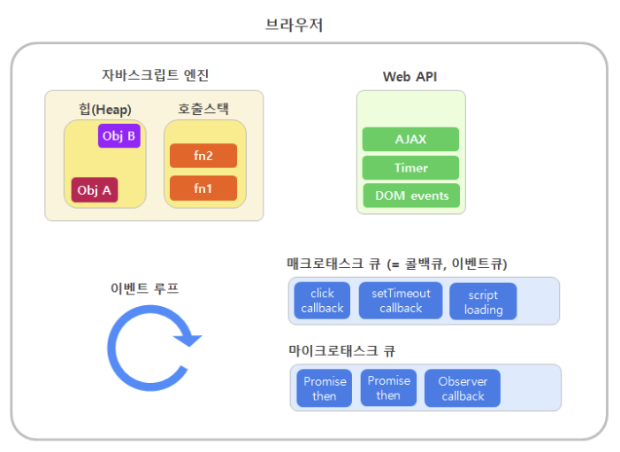

# 이벤트 루프와 태스크 큐

자바스크립트 엔진은 한 번에 하나의 작업만 처리하는 싱글스레드입니다. 하지만 여러 가지 일이 동시에 일어나는 것처럼 일을 처리하는데 이는 바로 이벤트 루프를 통해 구현된다.

### Javascript Runtime

런타임이란 프로그래밍 언어가 구동되는 환경을 말한다.

자바스크립트 런타임은 Javascript engine, Web API, Task Queue, Event Loop, Render Queue로 이루어져 있다.

### Javascript Engine

자바스크립트 엔진은 콜스택과 메모리 힙으로 구성되어 있다. 대표적으로 구글의 V8엔진이 있다.

#### 콜 스택 

함수를 호출하면 함수 실행 컨텍스트가 순차적으로 콜 스택에 푸시되어 실행된다. 

#### 메모리 힙

객체가 저장되는 메모리 공간

자바스크립트 엔진은 태스크가 요청되면 콜 스택을 통해 요청된 작업을 순차적으로 실행시킨다. 비동기 처리에서 자바스크립트 엔진이 담당한 소스코드 평가, 실행을 제외한 모든 처리는 자바스크립트를 구동하는 환경인 브라우저가 한다.

### Web API

Web API는 브라우저에서 제공하는 API로 DOM, Ajax, TimeOut 등이 있다. CallStack에서 실행된 비동기 함수는 Web API를 호출하고, Web API는 콜백 함수를 Task Queue에 넣는다.

브라우저 환경에는 태스크 큐와 이벤트 루프가 있다.

### 태스크 큐

비동기 함수의 콜백 함수나 이벤트 핸들러가 일시적으로 보관되는 영역이다. 이벤트 루프가 태스크 큐의 첫번재 태스크를 가져오는 것이 아니라, 실행 가능한 첫번째 태스크를 가져오는 것으로 태스크 중에서 가장 오래된 태스크를 가져온다.

비동기 작업들은 태스크 큐라는 저장공간에 들어가게 되는데, 발생한 순서대로 큐에 쌓이고 이벤트 루프에 의해 처리된다. 

태스크 큐는 매크로 태스크 큐와 마이크로 태스크 큐로 구분할 수 있는데, 마이크로 태스크 큐가 매크로 태스크 큐보다 우선순위가 높다. 그렇기 때문에 항상 마이크로 태스크의 작업이 먼저 처리된다.

- 매크로 태스크 : DOM 이벤트 콜백, 타이머(setTimeout, setInterval), 스크립트 로딩, requestAnimationFrame 등
- 마이크로 태스크 : 프로미스 핸들러(then/catch/finally) + await, Object.observe, procss(MutationObserver 등)

### 이벤트 루프

콜 스택에 현재 실행 중인 실행 컨텍스트가 있는지, 태스크 큐에 대기중인 함수가 있는지 반복해서 확인한다. 콜 스택이 비어있고 태스크 큐에 대기 중인 함수가 있다면 이벤트 루프는 순차적으로 태스크 큐에 대기 중인 함수를 콜 스택으로 이동시킨다. 

1. 호출스택이 비었는지 지속적으로 확인한다.
2. 호출 스택이 비게 되면 제일 먼저 마이크로 태스크 큐를 확인하고 가장 오래된 태스크부터 꺼내서 호출스택으로 전달해 주는데, 이걸 **마이크로태스크 큐가 텅 비어있을때까지 수행한다.**
3. 모든 마이크로태스크가 처리된 직후, 렌더링 작업이 필요하면 렌더링을 수행한다.
4. 매크로 태스크 큐를 확인한다.
5. 매크로 태스크 큐에서 가장 오래된 태스크 하나를 꺼내 호출 스택에 전달해 준다.
6. 다시 1번 으로 돌아간다.

여기서 알아야할 점은 브라우저는 **매크로태스크 하나를 처리할 때마다 마이크로 태스크 전부를 다 처리하고 렌더링을 수행한다는 것**이다.

그래서 마이크로태스크가 전부 처리되기 전까지는 UI 렌더링이나 네트워크 요청은 절대 일어나지 않는다.