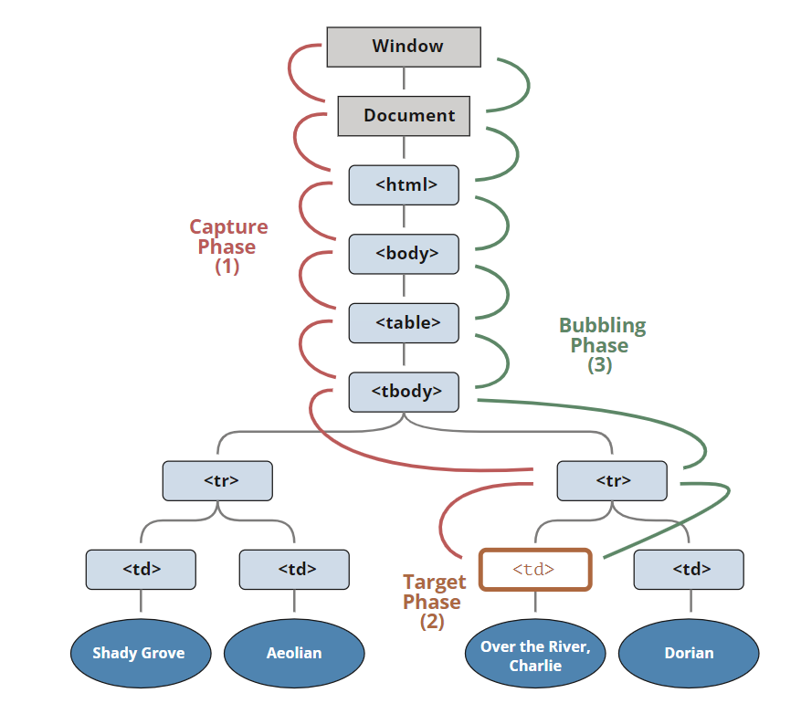

# 이벤트 버블링과 캡처링

계층적 구조에 포함되어 있는 HTML 요소에 이벤트가 발생할 경우 연쇄적 반응이 일어난다.

이벤트가 전파되는데 전파방향에 따라 버블링과 캡처링으로 구분할 수 있다.

**주의할 것은 버블링과 캡처링은 둘 중에 하나만 발생하는 것이 아니라 캡처링부터 시작하여 버블링으로 종료한다는 것이다.**



`<td>`를 클릭하면 이벤트가 최상위 조상에서 시작해 아래로 전파되고(캡처링 단계), 이벤트가 타깃 요소에 도착해 실행된 후(타깃 단계), 다시 위로 전파됩니다(버블링 단계). 이런 과정을 통해 요소에 할당된 이벤트 핸들러가 호출됩니다.


## 이벤트 버블링

자식요소에서 발생한 이벤트가 부모 요소까지 전파하는 것.

```javascript
<form onclick="alert('form')">FORM
  <div onclick="alert('div')">DIV
    <p onclick="alert('p')">P</p>
  </div>
</form>
```

위의 코드를 실행하게 되면 만약 p를 누르면 p -> div -> form 순서대로 alert이 뜨게된다. div를 눌러도 div -> form 순서대로 alert이 뜨는 것을 확인할 수 있다. 점점 상위요소로 옮겨가면서 동작되는 것을 알 수 있다.

이런 흐름을 버블링 이라고 한다. focus 이벤트 같은 몇몇 이벤트를 제외하고 거의 모든 이벤트는 버블링이 된다. 


## 이벤트 캡처링

자식 요소에서 발생한 이벤트가 부모 요소로부터 시작해서 이벤트를 발생시킨 자식 요소까지 도달하는 것. 캡처링 단계는 거의 쓰이지 않고, 캡처링을 하는 코드는 실제로 보기 어렵다.


### 전파 방지하기

```javascript
<body>
    <div class="div3">
        <div class="div2">
            <div class="div1">
            </div>
        </div>
    </div>
</body>
```

1. **event.stopPropagation()**

버블링 단계에서 상위 요소로 가는 것을 막아준다. 

위의 예제로 예를 들면, div1에 여러개의 리스너가 등록되어 있으면, 모두 실행을 하고 부모 요소로 가는 전파는 막아준다.

2. **event.stopImmediatePropagation()**

같은 요소의 다른 이벤트들을 막고, 상 요소로 전파되는 것도 막는다. 

위의 예제로 예를 들면, div1에 여러개의 리스터가 등록되어 있어도 div1의 첫번째 이벤트만 실행되고 전파도 막는다.

3. **event.preventDefault()**

코드의 기본 기능까지 막아주는 메서드이다. 따라서 이벤트 전파뿐만 아니라 동작 자체를 못하게 만든다. 


하지만 이벤트를 막아야 하는 경우 거의 없으니, 꼭 필요한 경우를 제외하고는 버블링을 막지않는 것이 좋다. 버블링을 막아야 하는 상황에서는 왠만하면 커스텀 이벤트 등을 사용해 해결할 수 있다.